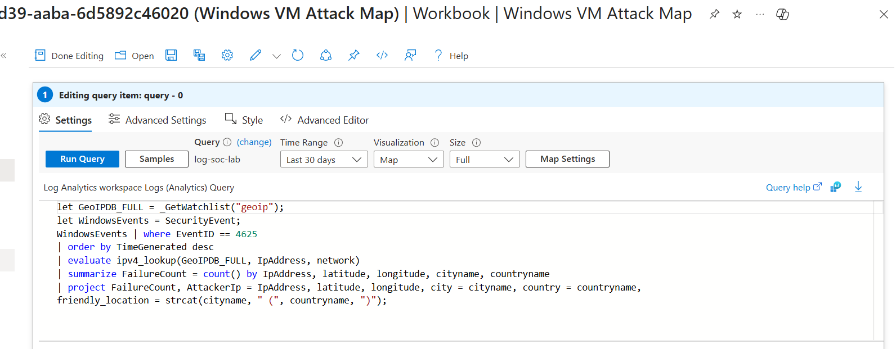
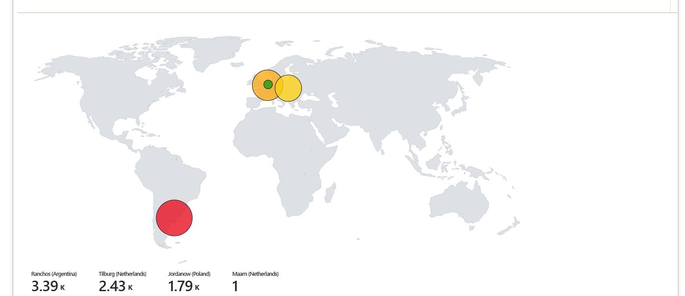

# Azure-Sentinel-Threat-Hunting-Lab

Overview and Objectives
Goal - Build a cloud based home lab through Microsoft Azure where I create and configure a VM to where it is open to the public, acting as a honeypot. Utilize SIEM tools such as Sentinel to monitor attacker activity and gain information on real attackers.
Tools - Azure Virtual Machine, log analytics, Microsoft Sentinel(Azure SIEM), Threat detection workflows, Network Security Groups(NSGs), KQL(Kusto Query Language), MITRE ATT&CK Framework Integration

Here Is a hand drawn diagram of what my environment setup looks like. I used this for reference before I began the actual lab setup. 

Azure Setup and VM Configuration
1. In Azure, created new resource groups so all of my materials from the lab are organized in one place for easier management.
2. Created a new Windows 10 virtual machine which would function as a honeypot for attackers around the net, configured its size, region, network settings, and authentication methods.
3. In VM's network seciurity group settings I disabled current default inbound traffic rules and set a new one - allowing any type of traffic, from any IP address, to any port.

5. To confirm the VM's accessability I pinged the VM from my own machine to make sure that it was reachable.

6. Logged into the VM from my own machine using RDP and the created credentials. In the VM I completely turned off all windows firewall restrictions to allow all traffic to enter.

Configuring and Analyzing Log Data
1. To test that security logs were functioning I did a test failed authentication attemp with the account test and made sure that I could identify the attempts in the logs (security event ID 4625).

KGL, Sentinel, and Log Forwarding
1. Created a Log Analytics Workspace in Azure and connected it to my VM for central log collection and analysis
2. Then created a Microsoft Sentinel Instance connected to the Workspace, configured the Windows Security Events through AMA connector and created a Data Collection Rule(DCR)
3. The Log Analytics Workspace allowed me to run queries in KGL that would allow me to sort through the security event log that had accumilated thousands of events from leaving the honeypot open.
4. Simple queries such as
   SecurityEvent
   | where EventID == 4625
were able to sort through the extensive log history and give me every event of a failed log in attempt.
[failed login attempts](images/FailedLogIns.png)
6. Through Sentinel I was also able to obtain aditional information on the attackers method of attack through the MITRE ATT&CK framework functionality it had whoch gave a number of instances of different type of attack stategies being used against my VM
[attack vectors](images/ATT&CKToSeeAttackvectors.png)

Added Location Functionality
1. Each security event had information like the attacker username and IP address. I wanted to tke their IP addresses and convert them to locations to find where my machine was commonly being accessed from
2. To do this I downloaded a dataset that containned geoip information with 54,000 rows in it
3. I imported this dataset into a watchlist through sentinel which I was then able to utilize in the log workspace environment

5. Importing the watchlist to the KGL environment would give each security event new information regarding the exact location of where the user attempted to log in from. This added more details an context for each security incident that was recorded.

Taking Location Data and Aggregating it into an Attack Map
1. To create a visual map of the new location data I created a new workbook in sentinal and configured a JSON script that would create a visual of the attack vectors

3. Doing this aggregated all of the security log data and turned it into a visula making it easy to see where each incident was occurring from. In this case there were a high concentration of attack originating from Argentina, The Netherlands, and Poland.
